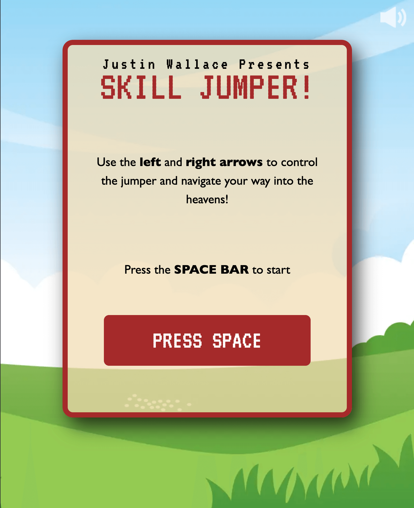

# Skill Jumper
## Overview
Skill Jumper is a responsive mobile or desktop game that uses arrow keys or phone tilt to move an avatar side to side to jump up the skill platforms. It was programmed via DOM manipulation using HTML, CSS, and JavaScript/jQuery. 
> This is the first thing I ever programmed, and was done as a school project. 

## Where to play it
The repository can be downloaded and ran locally via `index.html` or you can just check it out live on Netlify [here](https://skill-jumper.netlify.app). 
 
 

